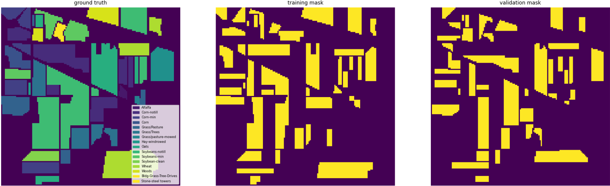
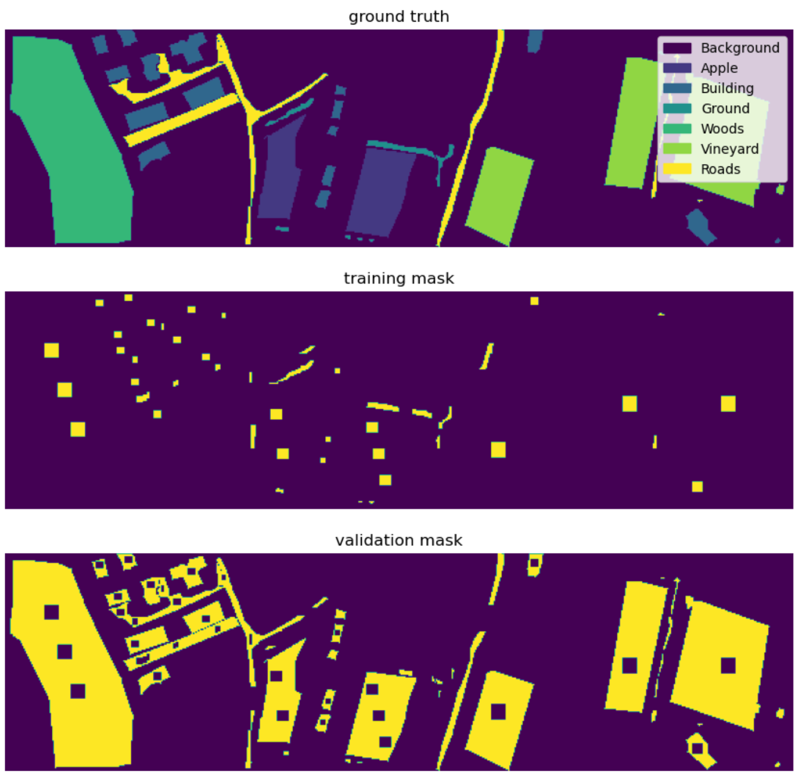
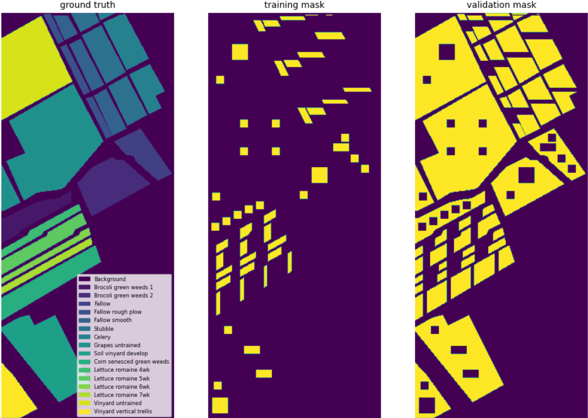

# Collection of Spatially Disjoint HSI datasets

This is a collection of HSI datasets with disjoint train/test split. We build this dataset as few papers follow the official train test split provided by [IEEE GRSS DASE](http://dase.grss-ieee.org/) (Data and Algorithm Standard Evaluation).

## Usage

All datasets are saved as a hdf5 file (`.h5`) with four fields:

```
   HSI: uint16 hyper-spectral image (CHW order)
    gt: ground truth
trMask: binary matrix indicating whether corresponding pixels are for training
vaMask: binary matrix indicating whether corresponding pixels are for validation
```

Check `loader.py` for usage. You can easily use this repo as a submodule to integrate into your existing code base. Supposing this repo is a submodule in the `./data` folder in your project, using the code below,

```python
import os
from data.loader import LoadDataset

trSet, vaSet = LoadDataset(
    os.path.join('./data', 'IndianPines.h5'),
    patchSize=11,
    norm=True)
```

you will obtain a spatially disjoint `Indian Pines` dataset for training and validation, where the patch size is $11 \times 11$ and pixel values are normalized by z-score normalization.

## Datasets

### Indian Pine

220 Band Hyperspectral Image: June 12, 1992 AVIRIS image Indian Pine Test Site 3.

#### Data source

- `data+label`: https://purr.purdue.edu/publications/1947/1
  - `19920612_AVIRIS_IndianPine_Site3_gr.tif` provides ground truth for all pixels.
  - `19920612_AVIRIS_IndianPine_Site3.tif` provides raw HSI data.
- `train split`: http://dase.grss-ieee.org/index.php
  - `indianpines_ts.tif` provides ground truth for training.

#### Train/test split

Note that DASE train test split has something wrong with class 7 and 11 (see below for their names). As after applying `19920612_AVIRIS_IndianPine_Site3_gr.tif` and `indianpines_ts.tif` together, it is obvious that all 26 pixels of `Grass/pasture-mowed` are for training (0 pixel for testing), and there are 10 pixel more in `Soybeans-min` for training. These wrong 10 pixels are

- x: 108, 109, 110, 111, 108, 109, 110, 111, 110, 111
- y:  76,  76,  76,  76,  77,  77,  77,  77,  78,  78

They should be in the testing dataset for `Grass/pasture-mowed` rather than as training samples for `Soybeans-min`. Check `IndianPinesFix.ipynb` (in `./creation`) for detailed elaboration.

After fix this problem, we have

| Class No. | Class Name             | # pixels (all) | # pixels (train) | # pixels (test) |
|-----------|------------------------|----------------|------------------|-----------------|
| 0         | Background*            | 10659          | -                | -               |
| 1         | Alfalfa                | 54             | 29               | 25              |
| 2         | Corn-notill            | 1434           | 762              | 672             |
| 3         | Corn-min               | 834            | 435              | 399             |
| 4         | Corn                   | 234            | 146              | 88              |
| 5         | Grass/Pasture          | 497            | 232              | 265             |
| 6         | Grass/Trees            | 747            | 394              | 353             |
| 7         | Grass/pasture-mowed    | 26             | 16               | 10              |
| 8         | Hay-windrowed          | 489            | 235              | 254             |
| 9         | Oats                   | 20             | 10               | 10              |
| 10        | Soybeans-notill        | 968            | 470              | 498             |
| 11        | Soybeans-min           | 2468           | 1414             | 1054            |
| 12        | Soybean-clean          | 614            | 328              | 286             |
| 13        | Wheat                  | 212            | 132              | 80              |
| 14        | Woods                  | 1294           | 728              | 566             |
| 15        | Bldg-Grass-Tree-Drives | 380            | 291              | 89              |
| 16        | Stone-steel towers     | 95             | 57               | 38              |
| Total     |                        | 21025(145*145) | 5679             | 4687            |

* Note that background is usually not considered in existing benchmarks.

Visualization:



#### Citation

```
@article{baumgardner2015220,
  title={220 band aviris hyperspectral image data set: June 12, 1992 indian pine test site 3},
  author={Baumgardner, Marion F and Biehl, Larry L and Landgrebe, David A},
  journal={Purdue University Research Repository},
  volume={10},
  number={7},
  pages={991},
  year={2015}
}
```

### University of Pavia

103 Band Hyperspectral Image: July 8, 2002

#### Data source

- `data+label`: https://www.ehu.eus/ccwintco/index.php/Hyperspectral_Remote_Sensing_Scenes#:~:text=820-,Pavia%20University%20scene,-Download%20MATLAB%20data
  - `PaviaU_gt.mat` provides ground truth for all pixels.
  - `PaviaU.mat` provides raw HSI data. (`pavia_ds.tif` from IEEE DASE is exactly the same as this one.)
- `train split`: http://dase.grss-ieee.org/index.php
  - `pavia_ts.tif` provides ground truth for training.

Unfortunately, the disjoint train/test split provided from IEEE DASE conflicts with the ground truth. There are 1147 pixels that are `background` in `PaviaU.mat` with non-`background` labels in `pavia_ts.tif`. Note that there are roughly only 4k pixels for training. The problem here is not trivial to solve as far as I can imagine. Therefore, I decide to not use this dataset for experiments claiming disjoint train/test split is utilized. You can find details in `UniPaviaProblem.ipynb`.


### University of Trento

63 band, six classes with an image size of 600 × 166 pixels and a spatial resolution of 1 m.

#### Data source

https://github.com/Cimy-wang/AM3Net_Multimodal_Data_Fusion

#### Train/test split

We perform train/test split ourselves by hand. We try to keep #pixels for training similar per class. We have

| Class No. | Class Name    | # pixels (all)   | # pixels (train) | # pixels (test) |
|-----------|---------------|------------------|------------------|-----------------|
| 0         | Background*   | 69386            | -                | -               |
| 1         | Apple         | 4034             | 360              | 3674            |
| 2         | Building      | 2903	           | 394              | 2509            |
| 3         | Ground        | 479	             | 365              | 114             |
| 4         | Woods         | 9123	           | 363              | 8760            |
| 5         | Vineyard      | 10501	           | 396              | 10105           |
| 6         | Roads         | 3174	           | 398              | 2776            |
| Total     |               | 99600(600 × 166) | 2276             | 27938           |

* Note that background is usually not considered in existing benchmarks.

Visualization:



#### References

- Rasti, B., Ghamisi, P., & Gloaguen, R. (2017). Hyperspectral and LiDAR fusion using extinction profiles and total variation component analysis. IEEE Transactions on Geoscience and Remote Sensing, 55(7), 3997-4007.
- Wang, J., Li, J., Shi, Y., Lai, J., & Tan, X. (2022). AM³Net: Adaptive mutual-learning-based multimodal data fusion network. IEEE Transactions on Circuits and Systems for Video Technology, 32(8), 5411-5426.


### Salinas

224 band AVIRIS sensor over Salinas Valley, California.

#### Data source

- https://www.ehu.eus/ccwintco/index.php?title=Hyperspectral_Remote_Sensing_Scenes

#### Train/test split

We perform train/test split ourselves by hand. We try to keep #pixels for training similar per class. We have

| Class No. | Class Name                | # pixels (all)   | # pixels (train) | # pixels (test) |
|-----------|---------------------------|------------------|------------------|-----------------|
| 0         | Background*               | 56975            | -                | -               |
| 1         | Brocoli green weeds 1     | 2009             | 500              | 1509            |
| 2         | Brocoli green weeds 2     | 3726             | 500              | 3226            |
| 3         | Fallow                    | 1976             | 500              | 1476            |
| 4         | Fallow rough plow         | 1394             | 503              | 891             |
| 5         | Fallow smooth             | 2678             | 513              | 2165            |
| 6         | Stubble                   | 3959             | 527              | 3432            |
| 7         | Celery                    | 3579             | 502              | 3077            |
| 8         | Grapes untrained          | 11271            | 500              | 10771           |
| 9         | Soil vinyard develop      | 6203             | 500              | 5703            |
| 10        | Corn senesced green weeds | 3278             | 514              | 2764            |
| 11        | Lettuce romaine 4wk       | 1068             | 497              | 571             |
| 12        | Lettuce romaine 5wk       | 1927             | 502              | 1425            |
| 13        | Lettuce romaine 6wk       | 916	             | 502              | 414             |
| 14        | Lettuce romaine 7wk       | 1070             | 499              | 571             |
| 15        | Vinyard untrained         | 7268             | 500              | 6768            |
| 16        | vinyard vertical trellis  | 1807             | 500              | 1307            |
| Total     |                           | 111104 (512*217) | 8059             | 46070           |

* Note that background is usually not considered in existing benchmarks.

Visualization:



#### Citation

```
@article{vane1993airborne,
  title={The airborne visible/infrared imaging spectrometer (AVIRIS)},
  author={Vane, Gregg and Green, Robert O and Chrien, Thomas G and Enmark, Harry T and Hansen, Earl G and Porter, Wallace M},
  journal={Remote sensing of environment},
  volume={44},
  number={2-3},
  pages={127--143},
  year={1993},
  publisher={Elsevier}
}

@inproceedings{gualtieri1999support,
  title={Support vector machine classifiers as applied to AVIRIS data},
  author={Gualtieri, J Anthony and Chettri, Samir R and Cromp, Robert F and Johnson, LF},
  booktitle={Proc. Eighth JPL Airborne Geoscience Workshop},
  pages={8--11},
  year={1999}
}
```

## Dataset Creation

To reproduce dataset creation, first set up a jupyter notebook environment with necessary packages.

```bash
conda create --name <env-name> --file env
conda activate <env-name>
```

Then start jupyter notebook service:

```bash
jupyter notebook
```

Finally execute notebooks in `creation`.

To export the conda environment for further usage if needed, first activate the environment, then

```bash
conda list --explicit <env-file-path>
```

For different platforms, the [official conda document](https://conda.io/projects/conda/en/latest/user-guide/tasks/manage-environments.html) mentioned:

> An explicit spec file is not usually cross platform, and therefore has a comment at the top such as `platform: linux-64` showing the platform where it was created. This platform is the one where this spec file is known to work. On other platforms, the packages specified might not be available or dependencies might be missing for some of the key packages already in the spec.
